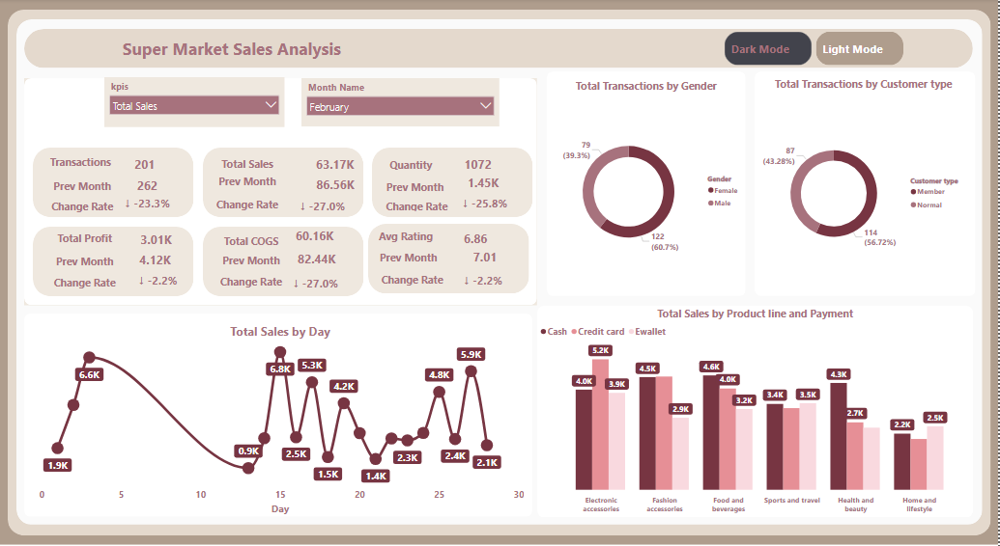
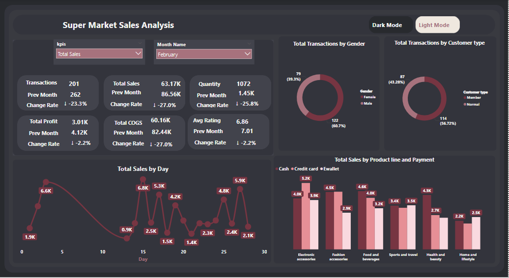

# 🛒 Supermarket Sales Analysis
## Overview
this project presents an interactive dashboard analyzing supermarket sales performance in details for every month according to kpis **(Total Sales ,Total Cogs ,Total Profit ,from Jan to june
Total Transactions and Total Quantity)**
## 🧹  Data Cleaning 
 load data in Power BI:

Click Transform Data → it opens Power Query Editor.

Common Cleaning Steps:

Rename Columns → make them clear and consistent.

Change Data Types → set columns to correct types (Date, Decimal, Whole Number, Text).

Remove Unnecessary Columns → right-click column → Remove.

Remove Blank or Error Rows:

Home → Remove Rows → Remove Blank Rows / Remove Errors.

Handle Missing Values (Nulls):

Replace with a fixed value → Transform → Replace Values.

Or remove rows with nulls.

Format Text Columns:

Transform → Format → Trim, Clean, UPPER/lower case.
## 🔑 Key Insights
- **Total Transactions:       (1K)**
- **Total Sales:             (322,97K)**
-  **Total Quantity          (5510)**
-  **Total Profit          (15,38)**
-  **Total Cogs            (307,59)**
- **Avg Rate                 (6,97)**

## 📊  Insights for every Month
## January Performance
**Overall** :
- **Total Transactions:       (262)**     
- **Total Sales:             (86,56K)** 
-  **Total Quantity          (1445)**
-  **Total Profit          (4,12K)**
-  **Total Cogs            (82,44)**
- **Avg Rate                 (7,01)**
- 
**Customer Performance(Transactions)**:
- Gender: **Male (47.33%)** vs. **Female (52.67%)**.
- Customer Type: **Normal (46.18%)** vs. **Member (53.82%)**.
  
**Daily Sales Trends**
- Sales **peaks up to 6K** and lows below **1.7K**.
  
**Daily Profit Trends**
- Sales **peaks up to 249** and lows below **81**.
  
**Daily Cogs Trends**
- Sales **peaks up to 5,7K** and lows below **1.6K**.
  
**Daily Quantity Trends**
- Sales **peaks up to 95** and lows below **32**.
  
**Daily Transactions Trends**
- Sales **peaks up to 17** and lows below **6**.

**Sales Product Line Performance**
-  **Sports and Travel** peaks up to  (**8K via Cash , 5,1K via Credit Card, 3,2K via Ewallet**)  
- then **Food & Beverages** (**5,2K via Cash , 5,9K via Credit Card, 3,7K via Ewallet**)
- **Health and Beauty** lows below (**3,9K via Cash , 5,1K via Credit Card, 4,1K via Ewallet**)

**Profit Product Line Performance**
- **Sports and Travel** peaks up to  (**300 via Cash , 241 via Credit Card, 151 via Ewallet**)
- then **Food & Beverages** (**246 via Cash , 280 via Credit Card, 177 via Ewallet**)
- **Health and Beauty** lows below (**185 via Cash , 243 via Credit Card, 195 via Ewallet**)

**Cogs Product Line Performance**
-  **Sports and Travel** peaks up to  (**7,6K via Cash , 4,8K via Credit Card, 3K via Ewallet**)  
- then **Food & Beverages** (**4,9K via Cash , 5,6K via Credit Card, 3,5K via Ewallet**)
- **Health and Beauty** lows below (**3,7K via Cash , 4,9K via Credit Card, 3,9K via Ewallet**)

**Quantity  Product Line Performance**
- **Electronic Accessories** peaks up to  (**97 item via Cash ,87 item via Credit Card,103 item via Ewallet**)  
- then  **Sports and Travel** peaks up to  (**153 item via Cash ,83 item via Credit Card,59 item via Ewallet**)  
- **Home and Life Style** lows below (**54 item via Cash ,79 item via Credit Card,62 item via Ewallet**) 

**Transactions Product Line Performance**
-**Sports and Travel**  peaks up to  (**21 item via Cash ,16 item via Credit Card,12 item via Ewallet**)  
- then **Electronic Accessories** peaks up to  (**14 item via Cash ,13 item via Credit Card,18 item via Ewallet**)  
- **Home and Life Style** lows below (**11 item via Cash ,14 item via Credit Card,14 item via Ewallet**)

 ## February Performance
**Overall** :
- **Total Transactions:       (201)**  and   **change rate Compared to the previous month:(-23%)**
- **Total Sales:             (63,17K)**  and  **change rate Compared to the previous month:(-27%)**
-  **Total Quantity          (1072)**  and   **change rate Compared to the previous month:(-25,8%)**
-  **Total Profit          (3,01K)**  and   **change rate Compared to the previous month:(-2,2%)**
-  **Total Cogs            (60,16)**  and   **change rate Compared to the previous month:(-27%)**
- **Avg Rate                 (6,86)** and   **change rate Compared to the previous month:(-2,2%)**
  
**Customer Performance(Transactions)**:
- Gender: **Male (39.3%)** vs. **Female (60.7%)**.
- Customer Type: **Normal (43.28%)** vs. **Member (56.72%)**.
  
**Daily Sales Trends**
- Sales **peaks up to 6,8K** and lows below **0.9K**.
  
**Daily Profit Trends**
- Sales **peaks up to 325** and lows below **44**.
  
**Daily Cogs Trends**
- Sales **peaks up to 6,5K** and lows below **0.9K**.
  
**Daily Quantity Trends**
- Sales **peaks up to 18** and lows below **106**.
  
**Daily Transactions Trends**
- Sales **peaks up to 19** and lows below **6**.

**Sales Product Line Performance**
- **Electronic Accessories** peaks up to  (**4K via Cash , 5,2K via Credit Card, 3,9K via Ewallet**)  
- then **Fashion Accessories** (**4,5K via Cash , 4,5K via Credit Card, 2,9K via Ewallet**)
- **Homme and life style** lows below (**2,2K via Cash , 2,2K via Credit Card, 2,5K via Ewallet**)

**Profit Product Line Performance**
- **Electronic Accessories** peaks up to  (**190 via Cash , 248 via Credit Card, 184 via Ewallet**)  
- then **Fashion Accessories** (**214 via Cash , 214 via Credit Card, 137 via Ewallet**)
- **Homme and life style** lows below (**107 via Cash , 97via Credit Card, 121 via Ewallet**)

**Cogs Product Line Performance**
- **Electronic Accessories** peaks up to  (**3,8K via Cash , 5K via Credit Card, 3,7K via Ewallet**)  
- then **Fashion Accessories** (**4,3K via Cash , 4,3K via Credit Card, 2,7K via Ewallet**)
- **Homme and life style** lows below (**2,2K via Cash , 2,1K via Credit Card, 2,4K via Ewallet**)

**Quantity  Product Line Performance**
- **Electronic Accessories** peaks up to  (**87 item via Cash ,63 item via Credit Card,75 item via Ewallet**)  
- then  **Food and bavarages** peaks up to  (**62 item via Cash ,71 item via Credit Card,73 item via Ewallet**)  
- **Home and Life Style** lows below (**35 item via Cash ,30 item via Credit Card,32 item via Ewallet**) 

**Transactions Product Line Performance**
-**Fashion Accessories**  peaks up to  (**15 item via Cash ,16 item via Credit Card,9 item via Ewallet**)  
- then **Electronic Accessories** peaks up to  (**16 item via Cash ,10 item via Credit Card,13 item via Ewallet**)  
- **Home and Life Style** lows below (**6 item via Cash ,6 item via Credit Card,6 item via Ewallet**)

## March Performance
**Overall** :
- **Total Transactions:       (228)**  and   **change rate Compared to the previous month:(13,4%)**
- **Total Sales:             (72,75K)**  and  **change rate Compared to the previous month:(15,2%)**
-  **Total Quantity          (1254)**  and   **change rate Compared to the previous month:(17%)**
-  **Total Profit          (3,46K)**  and   **change rate Compared to the previous month:(-,3%)**
-  **Total Cogs            (69,29K)**  and   **change rate Compared to the previous month:(15,2%)**
- **Avg Rate                 (6,83)** and   **change rate Compared to the previous month:(-,3%)**
 
**Customer Performance(Transactions)**:
- Gender: **Male (46.93%)** vs. **Female (53.07%)**.
- Customer Type: **Normal (45.61%)** vs. **Member (54.39%)**.
  
**Daily Sales Trends**
- Sales **peaks up to 7,2K** and lows below **1,3K**.
  
**Daily Profit Trends**
- Sales **peaks up to 62** and lows below **344**.
  
**Daily Cogs Trends**
- Sales **peaks up to 6,9K** and lows below **1.2K**.
  
**Daily Quantity Trends**
- Sales **peaks up to 117** and lows below **27**.
  
**Daily Transactions Trends**
- Sales **peaks up to 18** and lows below **6**.

**Sales Product Line Performance**
-  **Home and life style** peaks up to  (**5,2K via Cash ,3K via Credit Card, 5,8K via Ewallet**)  
- then **Electronic Accessories** (**5,5K via Cash , 1,8K via Credit Card, 6,1K via Ewallet**)
- **Fashion Accessories** lows below (**3,7K via Cash , 2,2K via Credit Card, 3,8K via Ewallet**)

**Profit Product Line Performance**
-  **Home and life style** peaks up to  (**249 via Cash 141 via Credit Card, 274 via Ewallet**)  
- then **Electronic Accessories** (**262 via Cash , 86 via Credit Card, 289 via Ewallet**)
- **Fashion Accessories** lows below (**178 via Cash , 106 via Credit Card, 183 via Ewallet**)

**Cogs Product Line Performance**
-  **Home and life style** peaks up to  (**5K via Cash 2,8K via Credit Card, 5,5K via Ewallet**)  
- then **Electronic Accessories** (**5,2K via Cash , 1,7K via Credit Card, 5,8K via Ewallet**)
- **Fashion Accessories** lows below (**3,6K via Cash , 2,1K via Credit Card, 3,7K via Ewallet**)

**Quantity  Product Line Performance**
- **Home and life style** peaks up to  (**83 item via Cash ,67 item via Credit Card,89 item via Ewallet**)  
- then **Electronic Accessories** peaks up to  (**100 item via Cash ,33 item via Credit Card,68 item via Ewallet**)  
- **Fashion Accessories** lows below (**49 item via Cash ,58 item via Credit Card,67 item via Ewallet**) 

**Transactions Product Line Performance**
- **Home and life style**  peaks up to  (**21 item via Cash ,16 item via Credit Card,12 item via Ewallet**)  
- then **Food and beverage** peaks up to  (**14 item via Cash ,13 item via Credit Card,18 item via Ewallet**)  
- **Health and beauty** lows below (**14 item via Cash ,12 item via Credit Card,16 item via Ewallet**) 

## April Performance
**Overall** :
- **Total Transactions:       (29)**  and   **change rate Compared to the previous month:(-87,3%)**
- **Total Sales:             (7,96K)**  and  **change rate Compared to the previous month:(-89,1%)**
-  **Total Quantity          (157)**  and   **change rate Compared to the previous month:(-87,5%)**
-  **Total Profit          (378,93)**  and   **change rate Compared to the previous month:(10,1%)**
-  **Total Cogs            (7,58K)**  and   **change rate Compared to the previous month:(-89,1%)**
- **Avg Rate                 (7,52)** and   **change rate Compared to the previous month:(10,1%)**
**Customer Performance(Transactions)**:
- Gender: **Male (37.93%)** vs. **Female (62.07%)**.
- Customer Type: **Normal (44.83%)** vs. **Member (55.17%)**.
  
**Daily Sales Trends**
- Sales **peaks up to 3,9K** and lows below **1.6K**.
  
**Daily Profit Trends**
- Sales **peaks up to 77** and lows below **185**.
  
**Daily Cogs Trends**
- Sales **peaks up to 3,7K** and lows below **1.5K**.
  
**Daily Quantity Trends**
- Sales **peaks up to 75** and lows below **32**.
  
**Daily Transactions Trends**
- Sales **peaks up to 12** and lows below **6**.

**Sales Product Line Performance**
-**Electronic Accessories** peaks up to  (**550 via Cash , 1178 via Credit Card**)  
- then **Home & Life Stye** (**1674 via Ewallet**)
- **Sports and Travel** lows below (**237 via Credit Card, 237 via Ewallet**)

**Profit Product Line Performance**
-**Electronic Accessories** peaks up to  (**26 via Cash , 56 via Credit Card**)  
- then **Home & Life Stye** (**80 via Ewallet**)
- **Sports and Travel** lows below (**11 via Credit Card, 11 via Ewallet**)

**Cogs Product Line Performance**
-**Electronic Accessories** peaks up to  (**524 via Cash , 1122 via Credit Card**)  
- then **Home & Life Stye** (**1674 via Ewallet**)
- **Sports and Travel** lows below (**226 via Credit Card, 226 via Ewallet**)

**Quantity  Product Line Performance**
- **Health and beauty** peaks up to  (**23 item via Cash ,15 item via Ewallet**)  
-**Electronic Accessories** peaks up to  (**19 via Cash , 16 via Credit Card**)  
- **Sports and Travel** lows below (**10 via Credit Card, 5 via Ewallet**)

**Transactions Product Line Performance**
-**Electronic Accessories** peaks up to  (**5 via Cash , 2 via Credit Card**)  
- **Health and beauty** peaks up to  (**4 item via Cash ,2 item via Ewallet**)  
- **Sports and Travel** lows below (**2 via Credit Card, 1 via Ewallet**)
## May Performance
**Overall** :
- **Total Transactions:       (41)**  and   **change rate Compared to the previous month:(41,4%)**
- **Total Sales:             (12,80K)**  and  **change rate Compared to the previous month:(60,8%)**
-  **Total Quantity          (212)**  and   **change rate Compared to the previous month:(35%)**
-  **Total Profit          (609,46)**  and   **change rate Compared to the previous month:(-4%)**
-  **Total Cogs            (12,19K)**  and   **change rate Compared to the previous month:(60,8%)**
- **Avg Rate                 (7,22)** and   **change rate Compared to the previous month:(-4%)**
  
**Customer Performance(Transactions)**:
- Gender: **Male (75.61%)** vs. **Female (24.39%)**.
- Customer Type: **Normal (24.39%)** vs. **Member (75.61%)**.
  
**Daily Sales Trends**
- Sales **peaks up to 6,2K** and lows below **3K**.
  
**Daily Profit Trends**
- Sales **peaks up to 297** and lows below **144**.
  
**Daily Cogs Trends**
- Sales **peaks up to 5,9K** and lows below **2.9K**.
  
**Daily Quantity Trends**
- Sales **peaks up to 103** and lows below **54**.
  
**Daily Transactions Trends**
- Sales **peaks up to 17** and lows below **12**.

**Sales Product Line Performance**
-  **Health and Beauty** peaks up to  (**1217 via Cash , 1048 via Credit Card,2030 via Ewallet**)  
- then **Home & life style** (**784 via Cash , 784 via Credit Card, 1190 via Ewallet**)
- **Electronic Accessories** lows below (**44 via Cash ,690 via Credit Card, 247 via Ewallet**)

**Profit Product Line Performance**
-  **Health and Beauty** peaks up to  (**61 via Cash , 50 via Credit Card, 97 via Ewallet**)  
- then **Home & life style** (**37 via Cash , 36 via Credit Card, 57 via Ewallet**)
- **Electronic Accessories** lows below (**2 via Cash ,33 via Credit Card, 12 via Ewallet**)

**Cogs Product Line Performance**
-  **Health and Beauty** peaks up to  (**1210 via Cash , 998 via Credit Card, 1933 via Ewallet**)  
- then **Home & life style** (**747 via Cash , 747 via Credit Card, 1134 via Ewallet**)
- **Electronic Accessories** lows below (**42 via Cash ,657 via Credit Card, 235 via Ewallet**)

**Quantity  Product Line Performance**
-  **Health and Beauty** peaks up to  (**19 item via Cash ,16 item via Credit Card,32 item via Ewallet**)  
- then **Home & life style** peaks up to  (**10 item via Cash ,23 item via Credit Card,19 item via Ewallet**)  
- **Electronic Accessories** lows below (**2 item via Cash ,7 item via Credit Card,3 item via Ewallet**) 

**Transactions Product Line Performance**
-  **Health and Beauty** peaks up to  (**2 item via Cash ,3 item via Credit Card,5 item via Ewallet**)  
- then **Home & life style** peaks up to  (**1 item via Cash ,5 item via Credit Card,3 item via Ewallet**)  
- **Electronic Accessories** lows below (**1 item via Cash ,1 item via Credit Card,1 item via Ewallet**) 

## June Performance
**Overall** :
- **Total Transactions:       (33)**  and   **change rate Compared to the previous month:(-19,5%)**
- **Total Sales:             (9,61K)**  and  **change rate Compared to the previous month:(-24,9%)**
-  **Total Quantity          (188)**  and   **change rate Compared to the previous month:(-11,3%)**
-  **Total Profit          (457,73)**  and   **change rate Compared to the previous month:(2,4%)**
-  **Total Cogs            (9,15K)**  and   **change rate Compared to the previous month:(-24,9%)**
- **Avg Rate                 (7,40)** and   **change rate Compared to the previous month:(2,4%)**
- 
**Customer Performance(Transactions)**:
- Gender: **Male (48.48%)** vs. **Female (51.52%)**.
- Customer Type: **Normal (42.42%)** vs. **Member (57.58%)**.
  
**Daily Sales Trends**
- Sales **peaks up to 3614** and lows below **2905**.
  
**Daily Profit Trends**
- Sales **peaks up to 172** and lows below **138**.
  
**Daily Cogs Trends**
- Sales **peaks up to 3442** and lows below **3767**.
  
**Daily Quantity Trends**
- Sales **peaks up to 73** and lows below **52**.
  
**Daily Transactions Trends**
- Sales **peaks up to 13** and lows below **9**.

**Sales Product Line Performance**
-  **Food & Beverages** peaks up to  (**995 via Credit Card, 1278 via Ewallet**)  
- then **Home & Life Style** (**495 via Cash , 878 via Credit Card, 449 via Ewallet**)
-  **Electronic Accessories** lows below (**149 via Cash , 521 via Credit Card, 241 via Ewallet**)

**Profit Product Line Performance**
- **Food & Beverages** peaks up to  (**47 via Credit Card,61 via Ewallet**)
- then **Home & Life Style** (**24 via Cash , 42 via Credit Card,21 via Ewallet**)
- **Electronic Accessories** lows below (**7 via Cash ,25 via Credit Card, 12 via Ewallet**)

**Cogs Product Line Performance**
-  **Food & Beverages** peaks up to  (**947 via Credit Card, 1217 via Ewallet**)  
- then **Home & Life Style** (**471 via Cash , 5, 837 via Credit Card, 428 via Ewallet**)
- **Electronic Accessories** lows below (**142 via Cash ,496 via Credit Card, 230 via Ewallet**)

**Quantity  Product Line Performance**
- **Food & Beverages** peaks up to  (**11 item via Credit Card,25 item via Ewallet**)  
- then  **Sports and Travel** peaks up to  (**7 item via Cash ,10 item via Credit Card,18 item via Ewallet**)  
- **Fashion Accessories** lows below (**11 item via Cash ,2 item via Credit Card,8  item via Ewallet**) 

**Transactions Product Line Performance**
-**Food & Beverages**  peaks up to  (**2 item via Credit Card,4 item via Ewallet**)  
- **Home and Life Style** lows below (**1 item via Cash ,2 item via Credit Card,1 item via Ewallet**)

## 📸 Dashboard Preview
## Light mode

## Dark mode

## 🛠️ Tools & Technologies
- **Power BI** – for dashboard design and visualization.  
- **Dataset** – Historical tea export data (2014–2023).

## 💡 Recommendations

 - Launch **targeted promotions** on low-sales days .
 -  Enhance **loyalty program  to attract and retain members.
- Promote **e-wallet and digital payments** with exclusive offers.
- Focus on the highest-selling and profitable products
- Preparing a  plan to improve performance of  products with weak sales and profits.
 

